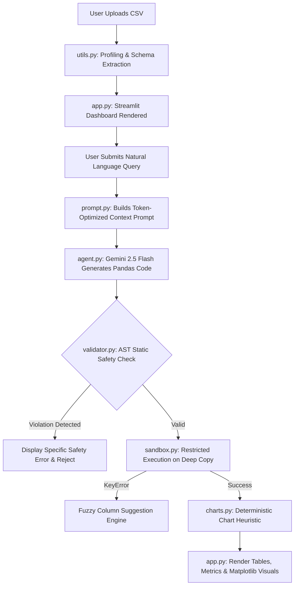

# 📊 AI Data Analyst Agent

> **Turn raw tabular datasets into actionable business insights, statistics, and visualizations using conversational plain English.**

---

## 📌 Overview

Traditional exploratory data analysis requires writing boilerplate Pandas transformations, handling missing data, and manually assembling plotting scripts. **AI Data Analyst Agent** bridges this gap by letting users upload any CSV dataset and query it conversationally. Powered by Google Gemini (`gemini-2.5-flash`), the system profiles the data, generates precise Pandas queries, runs them inside an isolated and AST-validated execution sandbox, and renders interactive metrics and publication-ready charts on the fly.

---

## ✨ Features

- **⚡ Automated Dataset Profiling:** Instantly inspect high-level KPIs upon upload—including total rows, columns, null value counts, duplicate rows, data types, and a 10-row interactive data preview.
- **💬 Natural Language Querying:** Ask complex data questions in conversational English (e.g., *"Which 5 product categories generated the highest profit margin?"*).
- **🧠 Context-Grounded Code Generation:** Uses the modern Google GenAI SDK (`google-genai`) with schema-aware prompt engineering to generate targeted Python/Pandas operations without hallucinating external schemas.
- **🛡️ AST-Based Static Code Validation:** Parses LLM code into Python's Abstract Syntax Tree (`ast.walk`) to enforce a strict whitelist—blocking arbitrary imports, system calls, loops, functions, and dunder methods before execution.
- **🔒 Isolated Runtime Sandbox:** Runs Pandas code within a restricted global/local execution scope using deep-copied DataFrames, protecting dataset state and preventing in-memory mutations.
- **🔍 Fuzzy Error Recovery:** Automatically catches `KeyError` exceptions and uses string similarity heuristics (`difflib`) to suggest existing columns when typos occur.
- **📈 Deterministic Auto-Visualization:** Automatically infers the optimal chart type (Bar Charts, Histograms, Scatter Plots, or Time-Series Line Charts) based on output data types and dimensions.
- **💻 Transparent Code Inspection:** Displays the generated, validated Python code alongside results with execution status badges for full auditability.

---

## 🏗️ Architecture & How It Works



### The Pipeline in Detail:
1. **Upload & Profiling (`utils.py`):** Loads the dataset with automated fallback encoding (`utf-8`, `latin-1`, `cp1252`) and computes dimensions, missing values, and column schema.
2. **Context Formulation (`prompt.py`):** Crafts a minimal token footprint prompt containing dataset shape, dtypes, and truncated sample records (first 3 rows).
3. **Model Orchestration (`agent.py`):** Passes the grounded context to Google Gemini (`gemini-2.5-flash`) at low temperature (`0.1`) to ensure deterministic Python code output.
4. **AST Code Validation (`validator.py`):** Inspects the parsed AST structure against `ALLOWED_NODE_TYPES`, rejecting imports, loops, function definitions, dunder attributes (`__`), and requiring exactly one assignment to `result`.
5. **Sandboxed Execution (`sandbox.py`):** Executes validated code within an environment limited to 21 safe built-ins, `pd`, and `np` on a deep copy of the DataFrame.
6. **Heuristic Charting (`charts.py`):** Analyzes the dimensions and types of `result` (e.g. 1 datetime + 1 numeric = Line Chart; 1 categorical + 1 numeric = Bar Chart) and renders a stylized Matplotlib figure.
7. **Interactive Presentation (`app.py`):** Streamlit presents the response as scalar metric cards, interactive DataFrames, JSON, or charts, with an expandable drawer to inspect the underlying code.

---

## 💻 Tech Stack

- **Core Language:** Python 3.10+
- **Frontend / UI:** [Streamlit](https://streamlit.io/)
- **LLM & Agent Reasoning:** [Google GenAI SDK](https://github.com/googleapis/python-genai) (`gemini-2.5-flash`)
- **Data Manipulation:** [Pandas](https://pandas.pydata.org/), [NumPy](https://numpy.org/)
- **Data Visualization:** [Matplotlib](https://matplotlib.org/)
- **Code Security & Analysis:** Python Native `ast` (Abstract Syntax Tree), `difflib`
- **Configuration & Environment:** `python-dotenv`

---

## ⚙️ Setup & Installation

### 1. Clone the Repository
```bash
git clone https://github.com/Aashi0105/Ai-data-analyst-agent.git
cd Ai-data-analyst-agent
```

### 2. Create and Activate Virtual Environment
- **On Windows (PowerShell):**
  ```powershell
  python -m venv venv
  .\venv\Scripts\Activate.ps1
  ```
- **On macOS / Linux:**
  ```bash
  python3 -m venv venv
  source venv/bin/activate
  ```

### 3. Install Dependencies
```bash
pip install -r requirements.txt
```

### 4. Configure Environment Variables
Copy the template configuration and supply your Google Gemini API key:
```bash
# On Windows (PowerShell)
Copy-Item .env.example .env

# On macOS / Linux
cp .env.example .env
```
Open `.env` in any text editor and replace the placeholder:
```env
GEMINI_API_KEY=your_actual_gemini_api_key_here
```
> Obtain a Gemini API key via [Google AI Studio](https://aistudio.google.com/).

### 5. Launch the Web Application
```bash
streamlit run app.py
```
The application will launch in your browser at `http://localhost:8501`.

---

## 🎯 Usage

1. **Upload Dataset:** Click **"Browse files"** in the sidebar to upload any `.csv` file.
2. **Review Profile:** Examine dataset dimensions, null counts, duplicate rows, and column schemas in the top tabs.
3. **Ask Questions:** In the query box, enter natural language queries such as:
   - *"What are the top 5 highest sales regions?"*
   - *"Show the monthly revenue trend over time"*
   - *"Find the distribution of customer age"*
   - *"What is the average transaction value by payment method?"*
4. **Inspect & Audit:** View the calculated metrics, tabular outputs, and generated charts. Expand **"View Executed Pandas Code"** to see the exact code executed.


## 📁 Project Structure

```
AI-Data-Analyst-Agent/
├── app.py           # Streamlit web app entry point and dashboard UI rendering
├── agent.py         # Gemini API client orchestration using the official google-genai SDK
├── validator.py     # AST-based static code analyzer and structural safety whitelist
├── sandbox.py       # Isolated execution sandbox with deep copying and fuzzy error recovery
├── charts.py        # Heuristic chart detection engine and Matplotlib figure generator
├── prompt.py        # Schema serialization and token-efficient system prompt templates
├── utils.py         # CSV ingestion, fallback encoding, dataset profiling, and value formatting
├── requirements.txt # Minimal production dependencies list
├── .env.example     # Sanitized environment variable template
├── .gitignore       # Comprehensive Git exclusion rules (secrets, venv, caches)
└── README.md        # Comprehensive project documentation
```

---

## 🛡️ Safety & Sandboxing Architecture

Allowing an LLM to generate and execute code dynamically presents significant Remote Code Execution (RCE) risks. This project implements a **two-phase defense model**:

1. **Static AST Analysis (`validator.py`):** Before code reaches Python's interpreter, it is parsed into an AST. Any syntax construct outside of `ALLOWED_NODE_TYPES` (such as `ast.Import`, `ast.FunctionDef`, `ast.While`, `ast.For`, `ast.Try`) is rejected. Furthermore, all access to dangerous identifiers (`os`, `sys`, `subprocess`, `eval`, `exec`, `open`, `compile`, `globals`, `locals`) and private attributes (dunder methods like `__class__`) are blocked.
2. **Namespace Isolation (`sandbox.py`):** The code executes inside a restricted dictionary containing only 21 verified safe built-ins (e.g., `len`, `range`, `sum`, `min`, `max`). The DataFrame is copied with `deep=True` so user datasets cannot be mutated in place.

---

## ⚠️ Limitations & Future Work

- **Single-Table Scope:** Current queries operate on a single CSV file per session (multi-table SQL joins across multiple files are not yet supported).
- **In-Memory Limits:** Optimized for standard tabular datasets loaded via Pandas into RAM; not designed for multi-gigabyte distributed big data (e.g., PySpark / Dask).
- **Visualization Scope:** Heuristic chart detection currently maps 1- and 2-variable relationships (Bar, Scatter, Line, Histogram). Support for multi-variable faceted plots (heatmaps, boxplots) is planned.

---

## 📄 License

This project is currently unlicensed. You may add an open-source license (such as [MIT](https://opensource.org/licenses/MIT)) if you intend to distribute or open-source it publicly.
